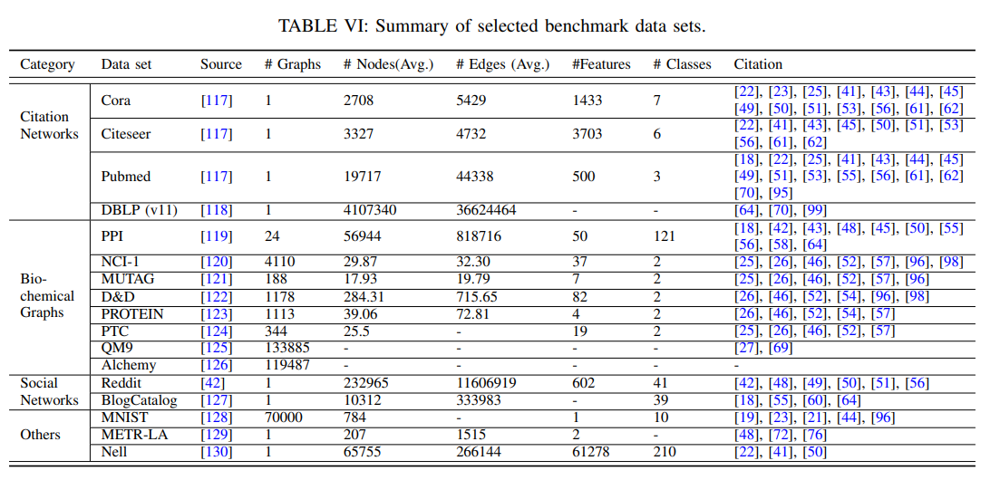

# 常用数据集
> 参考：《A Comprehensive Survey on Graph Neural Networks》

## 引文网络

+ Cora：https://s3.us-east-2.amazonaws.com/dgl.ai/dataset/cora_raw.zip
+ Pubmed：https://s3.us-east-2.amazonaws.com/dgl.ai/dataset/pubmed.zip
+ Citeseer：https://s3.us-east-2.amazonaws.com/dgl.ai/dataset/citeseer.zip

## 社交网络

+ Reddit：https://github.com/linanqiu/reddit-dataset
+ Epinions：http://www.trustlet.org/downloaded_epinions.html
+ BlogCatalog: https://figshare.com/articles/BlogCatalog_dataset/11923611

## 生物化学结构

+ PPI：http://snap.stanford.edu/graphsage/ppi.zip
+ QM9：https://github.com/geekinglcq/QM9nano4USTC
